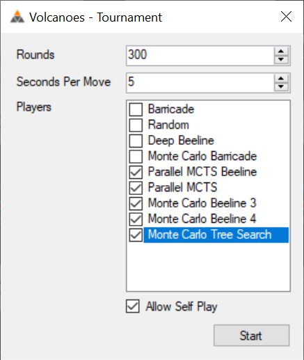

```{r setup, include=FALSE}
knitr::opts_chunk$set(echo = TRUE)
```

# Which of these four rules seems to make the game the most balanced?:

(And by balanced, I mean: less likely to give either the first or the second player an advantage over the other.)

1. Award tie games to the player that played the last turn.
2. Award tie games to the player that did not play the last turn.
3. Award tie games to the first player.
4. Award tie games to the second player.

Summary answer here:
https://github.com/simondorfman/volcanoes-game-design#answer-1

Below is the detailed answer showing my thought process and analysis with the answer at the end.

## Generate Data

I ran a many tournaments (using [Scott's most-excellent prototype with many high-quality bots](https://github.com/skotz/volcanoes)) with parameters like this:



1. I always used the top 5 bots with self-play turned on.
2. I used 5, 10, or 15 seconds of time per move.
3. I did as many rounds as I had computer time for, with the plan of eventually stitching all the results together.

The data is in a bunch of .CSV files in the "data" folder here:
https://github.com/simondorfman/volcanoes-game-design/tree/main/tie-games/data

The .CSV files look like this:

| Player One              | Player Two              | Winner | Termination | Total Moves | Total Milliseconds | Starting Tile Index | Transcript                                                                                                     | Winning Path One                                    | Winning Path Two                                    |
|-------------------------|-------------------------|--------|-------------|-------------|--------------------|---------------------|----------------------------------------------------------------------------------------------------------------|-----------------------------------------------------|-----------------------------------------------------|
| Parallel MCTS           | Monte Carlo Tree Search | Two    | Normal      | 21          | 101302             | 45                  | N28 S06 G N15 N06 G S22 N30 G N19 S39 G S27 S20+ G S21 N32+ G N39 N31+ G                                       |                                                     | N19 N05 N04 N16 N15 N14 N31 N30 S40 S21 S06 S20 S19 |
| Parallel MCTS           | Monte Carlo Beeline 4   | One    | Normal      | 21          | 99142              | 70                  | S06 S02 G S16 S23 G S35 S39 G N17 N28 G S19 S26 G S17 S11 G S36+ N26 G                                         | N34 S24 S23 S22 S21 S06 S20 S19 S18 S37 S36 S35 S34 |                                                     |
| Monte Carlo Beeline 3   | Monte Carlo Tree Search | Draw   | Normal      | 18          | 117958             | 5                   | N02 S17 G S21 S22 G N21 N31 G N33 S31 G S13 N06 G S06+ N06 G                                                   | N13 N03 N02 N01 N07 N06 N21 N22 S32 S31 S14 S13     | N15 N14 N31 N30 S40 S21 S06 S20 S19 S18 S17 S16 S15 |

## Data Prep

### Import all the tournament results data

```{r, results = 'hide', warning = FALSE, message = FALSE}

#load libraries 
library(tidyverse)
library(esquisse)
library(readr)
library(janitor)
library(DT) #datatables
library(knitr)
library(modelsummary)

#import 5-seconds-per-move data:
tourney_data_20201108010452 <- read_csv("data/5-seconds-per-move/tourney-data-20201108010452.csv")
tourney_data_20201110024323 <- read_csv("data/5-seconds-per-move/tourney-data-20201110024323.csv")
tourney_data_20201113012824 <- read_csv("data/5-seconds-per-move/tourney-data-20201113012824.csv")
tourney_data_20201113043639 <- read_csv("data/5-seconds-per-move/tourney-data-20201113043639.csv")
tourney_data_20201114015003 <- read_csv("data/5-seconds-per-move/tourney-data-20201114015003.csv")
tourney_data_20201116012230 <- read_csv("data/5-seconds-per-move/tourney-data-20201116012230.csv")
tourney_data_20201116033959 <- read_csv("data/5-seconds-per-move/tourney-data-20201116033959.csv")
tourney_data_20201116091511 <- read_csv("data/5-seconds-per-move/tourney-data-20201116091511.csv")
tourney_data_20201117062912 <- read_csv("data/5-seconds-per-move/tourney-data-20201117062912.csv")
tourney_data_20201119105522 <- read_csv("data/5-seconds-per-move/tourney-data-20201119105522.csv")
tourney_data_20201119114949 <- read_csv("data/5-seconds-per-move/tourney-data-20201119114949.csv")
tourney_data_20201119123308 <- read_csv("data/5-seconds-per-move/tourney-data-20201119123308.csv")
tourney_data_20201120051739 <- read_csv("data/5-seconds-per-move/tourney-data-20201120051739.csv")
tourney_data_20201120051908 <- read_csv("data/5-seconds-per-move/tourney-data-20201120051908.csv")
tourney_data_20201121010710 <- read_csv("data/5-seconds-per-move/tourney-data-20201121010710.csv")
tourney_data_20201122063859 <- read_csv("data/5-seconds-per-move/tourney-data-20201122063859.csv")
tourney_data_20201122064243 <- read_csv("data/5-seconds-per-move/tourney-data-20201122064243.csv")
tourney_data_20201123103158 <- read_csv("data/5-seconds-per-move/tourney-data-20201123103158.csv")
tourney_data_20201124041239 <- read_csv("data/5-seconds-per-move/tourney-data-20201124041239.csv")
tourney_data_20201124121054 <- read_csv("data/5-seconds-per-move/tourney-data-20201124121054.csv")
tourney_data_20201125024414 <- read_csv("data/5-seconds-per-move/tourney-data-20201125024414.csv")
tourney_data_20201125060531 <- read_csv("data/5-seconds-per-move/tourney-data-20201125060531.csv")
tourney_data_20201126101605 <- read_csv("data/5-seconds-per-move/tourney-data-20201126101605.csv")
tourney_data_20201128110131 <- read_csv("data/5-seconds-per-move/tourney-data-20201128110131.csv")

#combine all 5-seconds-per-move data into one dataframe:
df_5_seconds <-
  tourney_data_20201108010452 %>%
  bind_rows(tourney_data_20201110024323) %>%
  bind_rows(tourney_data_20201113012824) %>%
  bind_rows(tourney_data_20201113043639) %>%
  bind_rows(tourney_data_20201114015003) %>%
  bind_rows(tourney_data_20201116012230) %>%
  bind_rows(tourney_data_20201116033959) %>%
  bind_rows(tourney_data_20201116091511) %>%
  bind_rows(tourney_data_20201117062912) %>%
  bind_rows(tourney_data_20201119105522) %>%
  bind_rows(tourney_data_20201119114949) %>%
  bind_rows(tourney_data_20201119123308) %>%
  bind_rows(tourney_data_20201120051739) %>%
  bind_rows(tourney_data_20201120051908) %>%
  bind_rows(tourney_data_20201121010710) %>%
  bind_rows(tourney_data_20201122063859) %>%
  bind_rows(tourney_data_20201122064243) %>%
  bind_rows(tourney_data_20201123103158) %>%
  bind_rows(tourney_data_20201124041239) %>%
  bind_rows(tourney_data_20201124121054) %>%
  bind_rows(tourney_data_20201125024414) %>%
  bind_rows(tourney_data_20201125060531) %>%
  bind_rows(tourney_data_20201126101605) %>%
  bind_rows(tourney_data_20201128110131)

#add seconds_per_move column with value of "5" on every row
df_5_seconds <- df_5_seconds %>%
  mutate(seconds_per_move=5)

#import 10-seconds-per-move data:
tourney_data_20201107011621 <- read_csv("data/10-seconds-per-move/tourney-data-20201107011621.csv")
tourney_data_20201107092018 <- read_csv("data/10-seconds-per-move/tourney-data-20201107092018.csv")
tourney_data_20201108010101 <- read_csv("data/10-seconds-per-move/tourney-data-20201108010101.csv")
tourney_data_20201108010533 <- read_csv("data/10-seconds-per-move/tourney-data-20201108010533.csv")
tourney_data_20201108015848 <- read_csv("data/10-seconds-per-move/tourney-data-20201108015848.csv")
tourney_data_20201108103307 <- read_csv("data/10-seconds-per-move/tourney-data-20201108103307.csv")
tourney_data_20201108114511 <- read_csv("data/10-seconds-per-move/tourney-data-20201108114511.csv")
tourney_data_20201108125136 <- read_csv("data/10-seconds-per-move/tourney-data-20201108125136.csv")
tourney_data_20201109081240 <- read_csv("data/10-seconds-per-move/tourney-data-20201109081240.csv")
tourney_data_20201109081503 <- read_csv("data/10-seconds-per-move/tourney-data-20201109081503.csv")
tourney_data_20201109090951 <- read_csv("data/10-seconds-per-move/tourney-data-20201109090951.csv")
tourney_data_20201109123236 <- read_csv("data/10-seconds-per-move/tourney-data-20201109123236.csv")
tourney_data_20201110010537 <- read_csv("data/10-seconds-per-move/tourney-data-20201110010537.csv")
tourney_data_20201110015953 <- read_csv("data/10-seconds-per-move/tourney-data-20201110015953.csv")
tourney_data_20201110054202 <- read_csv("data/10-seconds-per-move/tourney-data-20201110054202.csv")
tourney_data_20201110083154 <- read_csv("data/10-seconds-per-move/tourney-data-20201110083154.csv")
tourney_data_20201111092802 <- read_csv("data/10-seconds-per-move/tourney-data-20201111092802.csv")
tourney_data_20201126094530 <- read_csv("data/10-seconds-per-move/tourney-data-20201126094530.csv")
tourney_data_20201129061929 <- read_csv("data/10-seconds-per-move/tourney-data-20201129061929.csv")

#combine all 10-seconds-per-move data into one dataframe:
df_10_seconds <-
  tourney_data_20201107011621 %>%
  bind_rows(tourney_data_20201107092018) %>%
  bind_rows(tourney_data_20201108010101) %>%
  bind_rows(tourney_data_20201108010533) %>%
  bind_rows(tourney_data_20201108015848) %>%
  bind_rows(tourney_data_20201108103307) %>%
  bind_rows(tourney_data_20201108114511) %>%
  bind_rows(tourney_data_20201108125136) %>%
  bind_rows(tourney_data_20201109081240) %>%
  bind_rows(tourney_data_20201109081503) %>%
  bind_rows(tourney_data_20201109090951) %>%
  bind_rows(tourney_data_20201109123236) %>%
  bind_rows(tourney_data_20201110010537) %>%
  bind_rows(tourney_data_20201110015953) %>%
  bind_rows(tourney_data_20201110054202) %>%
  bind_rows(tourney_data_20201110083154) %>%
  bind_rows(tourney_data_20201111092802) %>%
  bind_rows(tourney_data_20201126094530) %>%
  bind_rows(tourney_data_20201129061929)

#add seconds_per_move column with value of 10 on every row
df_10_seconds <- df_10_seconds %>%
  mutate(seconds_per_move=10)

#import 15-seconds-per-move data:
tourney_data_20201108114436 <- read_csv("data/15-seconds-per-move/tourney-data-20201108114436.csv")
tourney_data_20201114024632 <- read_csv("data/15-seconds-per-move/tourney-data-20201114024632.csv")
tourney_data_20201114085546 <- read_csv("data/15-seconds-per-move/tourney-data-20201114085546.csv")
tourney_data_20201114115158 <- read_csv("data/15-seconds-per-move/tourney-data-20201114115158.csv")
tourney_data_20201115105106 <- read_csv("data/15-seconds-per-move/tourney-data-20201115105106.csv")
tourney_data_20201115125158 <- read_csv("data/15-seconds-per-move/tourney-data-20201115125158.csv")

#combine all 15-seconds-per-move data into one dataframe:
df_15_seconds <-
  tourney_data_20201108114436 %>%
  bind_rows(tourney_data_20201114024632) %>%
  bind_rows(tourney_data_20201114085546) %>%
  bind_rows(tourney_data_20201114115158) %>%
  bind_rows(tourney_data_20201114115158) %>%
  bind_rows(tourney_data_20201115105106) %>%
  bind_rows(tourney_data_20201115125158)

#add seconds_per_move column with value of 15 on every row
df_15_seconds <- df_15_seconds %>%
  mutate(seconds_per_move=15)

#combine all 3 dataframes into one dataframe:
df <-
  df_5_seconds %>%
  bind_rows(df_10_seconds) %>%
  bind_rows(df_15_seconds)

#clean up column names
df <- clean_names(df)

```

Our dataframe currently looks like this:

```{r}
kable(df[1:3, ])
```

And a summary looks like this:
```{r, warning = FALSE}

datasummary_skim(df)
datasummary_skim(df, type="categorical")
```

### Add some calculated columns

```{r}
#add column called which_player_played_turn_before_game_end
# Translate this C# code to R so I can figure out whose turn went before game-end:
#         private Player GetPlayerForTurn(int turn)
#         {
#             switch ((turn - 1) % 6)
#             {
#                 case 0:
#                 case 4:
#                 case 5:
#                     return Player.One;
#                 case 1:
#                 case 2:
#                 case 3:
#                     return Player.Two;
#                 default:
#                     return Player.Empty;
#             }
#         }

# create column called winner_case_1 for this:
# 1. Award tie games to the player that played the last turn.

# create column called winner_case_2 for this:
# 2. Award tie games to the player that did not play the last turn.

# create column called winner_case_3 for this:
# 3. Award tie games to the first player.

# create column called winner_case_4 for this:
# 4. Award tie games to the second player.

```

